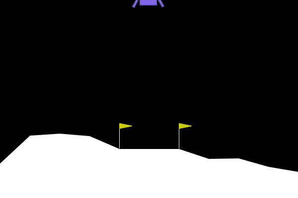
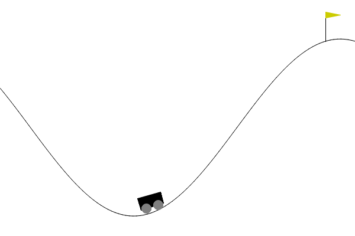

# Continuous control with deep reinforcement learning
The following is the [Deep Deterministic Policy Gradient (DDPG)](https://arxiv.org/pdf/1509.02971.pdf) algorithm applied to several OpenAI gym environments.

# Lunar Lander

  

    <h3>Episode 100</h3>
    

      
    

  

  

    <h3>Episode 500</h3>
    

      
    

  

  

    <h3>Episode 2000</h3>
    

      
    

  

The following figure shows the score the agent achieves per espisode of training.

# Mountain Car Continuous

The goal is to reach the flag in the least amount of time possible.

  

    <h3>Episode 50</h3>
    

      
    

  

  

    <h3>Episode 150</h3>
    

      
    

  

  

    <h3>Episode 300</h3>
    

      
    

  

The following figure shows the score the agent achieves per espisode of training.

 

# Pendulum

The goal is to swing the Pendulum into an upright position.

  

    <h3>Episode 20</h3>
    

      
    

  

  

    <h3>Episode 40</h3>
    

      
    

  

  

    <h3>Episode 200</h3>
    

      
    

  

The following figure shows the score the agent achieves per espisode of training.

 
